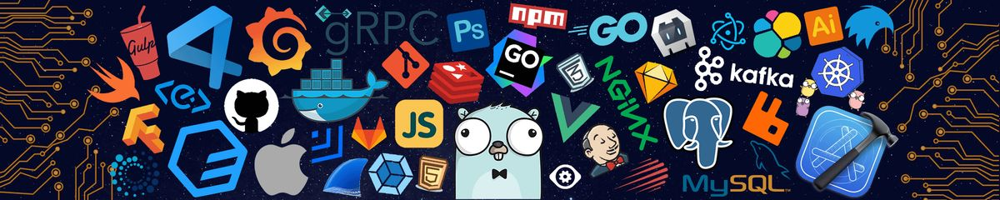
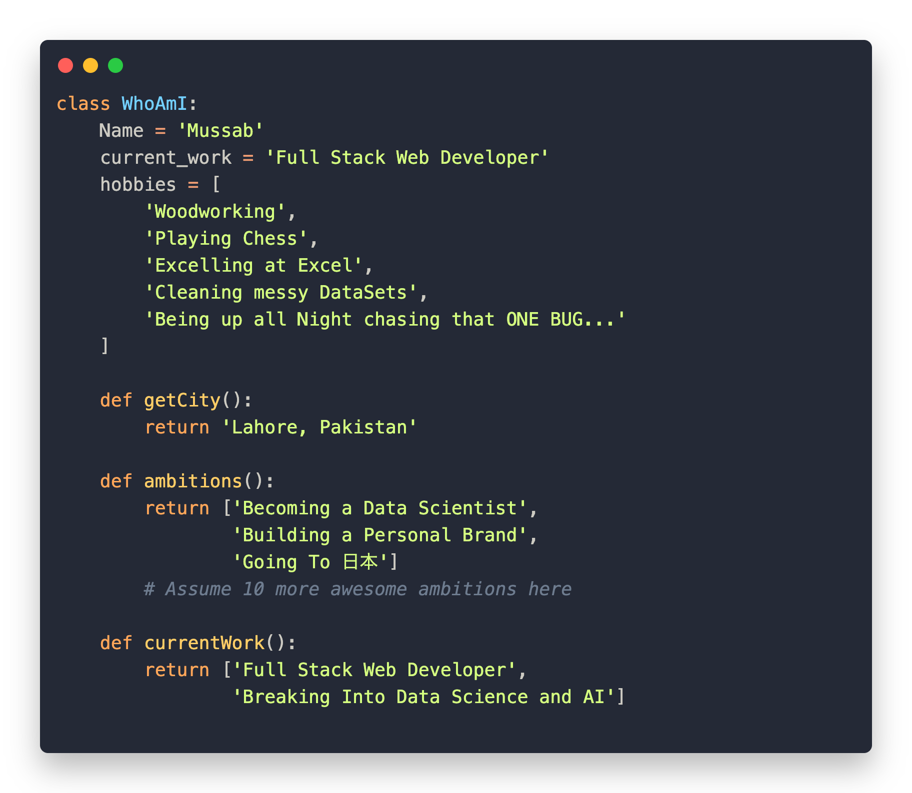

<!-- markdownlint-disable MD033 -->

  

 

 

A creative full-stack developer specializing in modern web applications, AI-powered solutions, and scalable SaaS products. I transform complex problems into elegant, user-friendly software that makes a real impact.

  &nbsp;
  &nbsp;
  &nbsp;
  &nbsp;
  

  &nbsp;
  

  

 

<h3>About Me 👨🏻‍💻</h3>

- 📍 &nbsp; Based in **Lahore, Pakistan** — open to **Remote & Contract Work**.
- 🔭 &nbsp; Currently building **AI Automation** workflows and **SaaS** products at **[FlowPath](https://www.flowpath.dev)**.
- 🌱 &nbsp; Exploring **Advanced AI/ML**, **Cloud Infrastructure**, and **System Design**.
- 💬 &nbsp; Ask me about **React, Next.js, Node.js, Python** — happy to help!
- 🤖 &nbsp; Passionate about **AI integration** and turning ideas into production-ready software.
- 🎨 &nbsp; I care about **clean code**, **great UX**, and **creative problem-solving**.
- ☕ &nbsp; _Great software lives at the intersection of clean code, user empathy, and creativity._

<h3 align="center">Featured Projects 🚀</h3>

<table>
  <tr>
    <td width="50%" valign="top">
      <h4>Atriulactea Portal 🏢</h4>
      
European recruitment platform connecting talent with opportunity across Portugal and Europe. Features employer dashboards, advanced candidate search, and multi-language support.

      

        
        
        
        
      

      
    </td>
    <td width="50%" valign="top">
      <h4>TryOllie — AI Meeting Assistant 🤖</h4>
      
AI-powered meeting companion providing real-time cues, contextual support, and automated summary generation for enterprise teams.

      

        
        
        
        
      

      
    </td>
  </tr>
  <tr>
    <td width="50%" valign="top">
      <h4>JuliaBot AI 🧠</h4>
      
Multi-purpose AI assistant platform handling psychological support, software dev assistance, creative brainstorming, and file analysis with context-aware conversations.

      

        
        
        
      

      
    </td>
    <td width="50%" valign="top">
      <h4>Fast Entry Test 🎓</h4>
      
Complete online testing platform with an extensive MCQ database (Math, IQ, English), timed examinations, and detailed performance analytics for students.

      

        
        
        
      

      
    </td>
  </tr>
  <tr>
    <td width="50%" valign="top">
      <h4>MBH PhysioRefit 🏥</h4>
      
Patient-focused physiotherapy clinic platform with comprehensive service catalog, therapist profiles, and integrated online appointment booking.

      

        
        
        
      

      
    </td>
    <td width="50%" valign="top">
      <h4>QR Menu Flowpath 🍽️</h4>
      
Contactless QR-based ordering platform transforming traditional menus into interactive digital experiences with real-time menu management and a built-in shopping cart.

      

        
        
        
        
      

      
    </td>
  </tr>
</table>

<h3 align="center">Languages and Tools 🛠</h3>

<strong>Languages</strong> 
  

<strong>Frontend</strong> 
  

<strong>Backend & Databases</strong> 
  

<strong>AI & Automation</strong> 
  
  
  

<strong>DevOps & Cloud</strong> 
  

<strong>Design & Tools</strong> 
  

  <table border="0">
    <tr>
      <td align="center">
        <h3 align="center">GitHub Stats 📊</h3>
        
      </td>
      <td align="center">
        <h3 align="center">Top Languages 🔝</h3>
        
      </td>
    </tr>
  </table>

<h3 align="center">Streak Stats 🔥</h3>

  

<h3 align="center">Let's Connect 📫</h3>

Ready to bring your ideas to life? Let's talk!

  &nbsp;
  

