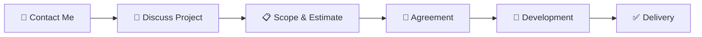

<div align="center">

# 👋 Hi, I'm Mussab

### Full-Stack Developer | AI Automation Engineer | SaaS Builder

[](https://mussabpro.github.io/Mussab-Resume)
[](https://www.flowpath.dev)
[](mailto:mussabomair16@gmail.com)
[](https://www.linkedin.com/in/mussab-omair/)
[](https://github.com/MussabPro)
[](https://www.youtube.com/@mussab.developer)
[](https://www.instagram.com/mussab.dev/)

📍 **Lahore, Pakistan** | 💼 **Open to Remote & Contract Work**

</div>

---

## 🚀 About Me

I'm a creative full-stack developer specializing in building modern web applications, AI-powered solutions, and scalable SaaS products. I transform complex problems into elegant, user-friendly software that makes a real impact.

```typescript
const mussab = {
  location: "Lahore, Pakistan 🇵🇰",
  workPreference: ["Remote", "Contract"],
  currentFocus: ["AI Automation", "SaaS Development", "Enterprise Solutions"],
  expertise: ["Full-Stack Development", "AI Integration", "Database Architecture"],
  learning: ["Advanced AI/ML", "Cloud Infrastructure", "System Design"]
};
```

---

## 💻 Tech Stack

### Languages
<div align="center">


</div>

### Frontend
<div align="center">


</div>

### Backend
<div align="center">


</div>

### Databases
<div align="center">


</div>

### DevOps & Cloud
<div align="center">


</div>

### AI & Automation
<div align="center">


</div>

### Design & Tools
<div align="center">


</div>

---

## 📊 GitHub Stats

<div align="center">


### 📈 Contribution Stats


<br/>


<br/>


</div>

---

## 🎯 Featured Projects

### 🏢 Enterprise & SaaS

#### **Atriulactea Portal** - European Recruitment Platform
> *Connecting talent with opportunity across Portugal and Europe*

🔗 [Live Demo](https://www.atriulactea.com/)

Comprehensive recruitment platform with employer dashboards, advanced candidate search, and multi-language support.

**Tech:** React • TypeScript • Node.js • MongoDB

**Features:**
- ✅ Employer dashboard for job posting & management
- ✅ Advanced search filters & candidate discovery
- ✅ Multi-language support (Portuguese/English)

---

#### **TryOllie** - AI Meeting Assistant
> *Intelligent meeting companion for enterprise teams*

🔗 [Live Demo](https://tryollie.io/)

AI-powered assistant providing real-time meeting cues, contextual support, and automated summary generation.

**Tech:** Node.js • Next.js • TypeScript • AI Integration

**Features:**
- ✅ Real-time meeting cues & suggestions
- ✅ Automated comprehensive summaries
- ✅ Action item tracking & follow-ups

---

### 🤖 AI Solutions

#### **JuliaBot AI** - Multi-Purpose AI Assistant
> *Versatile conversational AI for diverse professional needs*

🔗 [Live Demo](https://ai.juliabot.com/)

Intelligent AI platform handling psychological support, software development assistance, creative brainstorming, and file analysis.

**Tech:** Python • React • AI/ML

**Features:**
- ✅ Multi-domain expertise (psychology, dev, creative)
- ✅ File upload & analysis capabilities
- ✅ Context-aware conversations

---

### 🏥 Healthcare Technology

#### **MBH PhysioRefit** - Physiotherapy Clinic Platform
> *Professional healthcare services with seamless online booking*

🔗 [Live Demo](https://www.mbhphysiorefit.pk/)

Patient-focused website with detailed service descriptions, therapist profiles, and integrated appointment scheduling.

**Tech:** Next.js • React • Tailwind CSS

**Features:**
- ✅ Comprehensive service catalog
- ✅ Online appointment booking system
- ✅ Therapist profiles & credentials

---

#### **Flowpath Dental Demo** - Modern Dental Practice Website
> *Showcase dental clinic with integrated scheduling*

🔗 [Live Demo](https://flowpath-dental-demo.vercel.app/)

Demonstration website featuring appointment booking, patient testimonials, and Google Sheets integration.

**Tech:** Next.js • React • TypeScript • Google APIs

**Features:**
- ✅ Seamless appointment booking
- ✅ Google Sheets data integration
- ✅ Automated email confirmations

---

### 🎓 Education Technology

#### **Fast Entry Test** - Academic Assessment Platform
> *Comprehensive testing solution for students*

🔗 [Live Demo](https://fast-entry-test.vercel.app/)

Complete online testing platform with extensive MCQ database, timed examinations, and detailed performance analytics.

**Tech:** Next.js • React • TypeScript • Tailwind CSS

**Features:**
- ✅ Extensive question bank (Math, IQ, English)
- ✅ Timed test sessions with countdown
- ✅ Instant scoring & detailed reports

---

### 🍽️ Restaurant Technology

#### **QR Menu Flowpath** - Contactless Digital Menu
> *Modern QR-based ordering for restaurants*

🔗 [Live Demo](https://qr-menu-flowpath.vercel.app/)

Streamlined QR-based ordering platform transforming traditional menus into interactive digital experiences.

**Tech:** React • Next.js • Node.js • Tailwind CSS

**Features:**
- ✅ QR code instant access (no app required)
- ✅ Shopping cart with customization
- ✅ Real-time menu management

---

## 💼 Experience & Expertise

| Area               | Experience  | Highlights                                    |
|--------------------|-------------|-----------------------------------------------|
| 🌐 Web Development | 3+ years    | Full-stack SaaS, enterprise applications      |
| 📱 App Development | 1+ year     | Mobile-first, responsive designs              |
| 🤖 AI Automation   | 6+ months   | OpenAI integration, N8N workflows             |
| ☁️ Cloud & DevOps  | 2+ years    | Multi-cloud deployment, DNS configuration     |

### 🎯 What I Can Build For You

- ✨ **AI-Powered Applications** — Chatbots, assistants, automation workflows
- 🚀 **SaaS Products** — Multi-tenant platforms, subscription systems, admin dashboards
- 🏢 **Enterprise Solutions** — CRM, recruitment platforms, management systems
- 🛒 **E-Commerce** — Online stores, booking systems, payment integration
- 📊 **Data Systems** — Database design, analytics dashboards, reporting tools
- 🎨 **Modern Web Apps** — Responsive, fast, SEO-optimized websites

---

## 📫 Let's Connect

<div align="center">

### Ready to bring your ideas to life? Let's talk!

[](mailto:mussabomair16@gmail.com)
[](mailto:info@flowpath.dev)

[](https://www.flowpath.dev)
[](https://mussabpro.github.io/Mussab-Resume)

[](https://www.linkedin.com/in/mussab-omair/)
[](https://www.instagram.com/mussab.dev/)
[](https://www.youtube.com/@mussab.developer)

</div>

---

## 🤝 How We Can Work Together


```mermaid
graph LR
    A[📧 Contact Me] --> B[💬 Discuss Project]
    B --> C[📋 Scope & Estimate]
    C --> D[🤝 Agreement]
    D --> E[🚀 Development]
    E --> F[✅ Delivery]
```

1. **Reach Out** — Email me with your project brief
2. **Discussion** — I'll respond with questions & initial thoughts
3. **Proposal** — Receive scope, timeline, and cost estimate
4. **Kickoff** — Sign agreement & start development with milestones
5. **Delivery** — Get your product with documentation & support

---

<div align="center">

### ⭐ Fun Fact

*I believe great software is built at the intersection of clean code, user empathy, and creative problem-solving.*

---

**💡 Open to interesting projects and collaborations!**


</div>